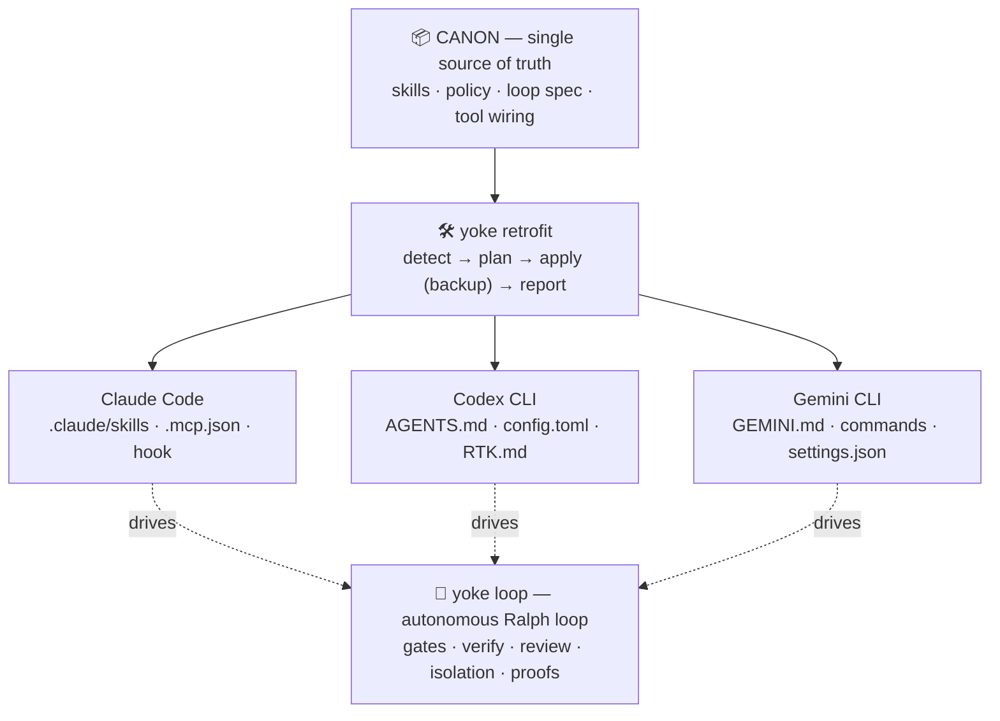
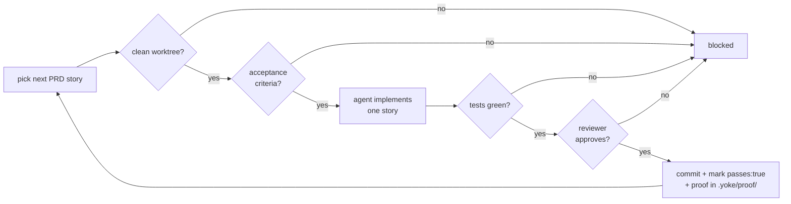

<div align="center">

# 🐂 Yoke

### One harness, three agents — and zero trust in "done."

**Yoke** installs one curated canon of skills, **mechanical safety gates**, and tool wiring into any project — natively for **Claude Code, OpenAI Codex CLI, and Gemini CLI**. Then, when you want it, an opt-in autonomous loop ships your spec story-by-story: tested, cross-model-reviewed, committed — **with a screenshot to prove every story and a video for every failure**.

[](https://github.com/HECer/yoke/actions/workflows/ci.yml)
[](#-license)


</div>

> **TL;DR** — `yoke new my-app --idea="..."` scaffolds a git repo, installs the harness for all three agents, and drafts a story backlog from your idea. `yoke loop run my-app --isolate --review` then implements it story by story behind hard gates: **clean tree → acceptance criteria → your real tests green → an independent model approves → commit**. If any gate is red, nothing is committed. When a story is done, there's a photo of it in `.yoke/proof/<story>/`.

---

## Why Yoke exists

Agentic coding in 2026 fails in four well-documented ways. Yoke answers each one **mechanically** — in code, not in a prompt the agent can ignore:

| The pain | What actually happens | What Yoke does about it |
|---|---|---|
| 🎭 **The verification gap** — *"agent says done, but it isn't"* | Agents submit confidently on 100% of runs while resolving far fewer; "all tests pass" when they were never run ([silent-failures research](https://arxiv.org/pdf/2603.25764)) | The loop trusts **your verify command's exit code**, never the agent's word. A story is `passes: true` only after tests are green, the reviewer approved, and the commit landed — atomically. Plus: **screenshot proofs** per story. |
| 🔀 **Three agents, three configs** | Teams hand-maintain `CLAUDE.md`, `AGENTS.md`, `GEMINI.md`, skills, and MCP wiring separately — copy-paste drift everywhere | **One canon → `yoke retrofit`** generates the idiomatic native artifacts for each agent. Change the canon once, re-retrofit everywhere. |
| 🌀 **Overnight loops going off the rails** | Raw Ralph-loop users "wake up to broken codebases that don't compile" | Yoke is **"Ralph, but with gates"**: clean-worktree gate, acceptance-criteria gate, green-tests gate, review gate, per-story worktree isolation, idle-timeout watchdog, single-flight lock, commit integrity. |
| 😵 **Review fatigue** | AI adoption nearly doubles PR volume and review time; humans start skimming | **`yoke review`**: a *second* model reviews the diff as a pass/fail exit-code gate — chainable into verify, pre-push, or CI. Cross-model review measurably catches what self-review misses. |

**Who it's for:** anyone driving Claude Code, Codex CLI, or Gemini CLI on real projects — especially if you use more than one, want autonomous runs you can trust, or are tired of "done" meaning "probably". Greenfield (`yoke new`) and brownfield (`yoke retrofit`) both work.

**Who it's not for:** if you want a chat pair-programmer with no process, you don't need a harness. Yoke is for shipping with discipline.

## ⏱️ 60 seconds: idea → tested, photographed software

```console
$ yoke new reading-app --idea="a web app that tracks my reading list"
✓ reading-app bootstrapped.        # git repo · harness for all agents · context · PRD drafted from the idea

$ yoke prd check reading-app
✓ PRD valid — 8 stories, 0 pass

$ yoke loop on reading-app
$ yoke loop run reading-app --isolate --review --max=10
▶ STORY-1 (0/8) — implementing… · verifying… · reviewing… ✔ committed → 1/8
▶ STORY-2 (1/8) — implementing… · verifying… ✔ committed → 2/8
▶ STORY-3 (2/8) — implementing… · verifying… ✘ blocked: story did not verify (tests red)
                                              # nothing was committed. fix, then re-run.

$ ls reading-app/.yoke/proof/STORY-2/
home.png  list.png                            # photographic evidence, labelled per story
```

Every claim in that transcript is enforced by code paths with tests behind them — 322 of them, and this repo was built by its own loop and gates ([how it was built](#-why--how-it-was-built)).

## 🚀 Quickstart

```bash
npm install -g @hecer/yoke                 # → global `yoke` on your PATH
# (or from source: git clone https://github.com/HECer/yoke.git && cd yoke && npm install && npm run build && npm link)

# Greenfield: idea → loop-ready project in one command
yoke new my-app --idea="a CLI that tracks reading lists"
yoke loop on my-app && yoke loop run my-app --isolate

# — or retrofit an existing project —
yoke validate canon                                          # 1) sanity-check the canon
yoke retrofit /path/to/project --agent=all                   # 2) install (non-destructive)
yoke loop on /path/to/project                                # 3) optional: the autonomous loop
yoke loop run /path/to/project --isolate --reviewer=codex --max=20
```

> Requires Node ≥ 20 and git. No global install? `node /path/to/yoke/dist/cli.js …` or `npm --prefix /path/to/yoke run yoke -- …` work too. The MCP tools (rtk, graphify/Serena, Playwright MCP) are wired by Yoke but installed separately — the generated config is a clearly-labelled, adjustable template.

### Or install the skills as a Claude Code plugin

The canon is also packaged as a Claude Code plugin — the repo is its own marketplace:

```text
/plugin marketplace add HECer/yoke
/plugin install yoke@yoke
```

That gives you all canon skills under the `yoke:` namespace (e.g. `yoke:tdd`, `yoke:review`) inside Claude Code — no retrofit needed. The `yoke` CLI (loop, gates, retrofit for Codex/Gemini) still comes from `npm i -g @hecer/yoke`. Gemini CLI users can likewise `gemini extensions install https://github.com/HECer/yoke`.

## 🤖 Driving it through an agent

Yoke is meant to be operated *by* your coding agent — after a retrofit, the agent has the skills, the safety policy, and the routing, so it knows the methodology. Copy-paste prompts (identical wording works for Claude Code, Codex CLI, and Gemini CLI):

> **Set it up** — *"Install the Yoke harness in this project: run `yoke retrofit . --agent=all`, pick the code-graph you'd recommend for this codebase, and leave the autonomous loop disabled for now. Then summarise what changed and commit it."*

> **Work the disciplined way** — *"From now on follow the Yoke skills you just installed: brainstorm → spec → plan → TDD → review before merging. Use the `review` skill before any merge."*

> **Run autonomously** — *"Write `.yoke/prd.yaml` with one story per task (each needs acceptance criteria — see the `authoring-prd` skill), set `verify.command` in `.yoke/config.yaml`, enable the loop with `yoke loop on .`, then run it in small visible batches: `yoke loop run . --max=5`. After each batch show me `yoke loop status .`."*

> **Watch / unblock** — *"Run `yoke loop status .`. If it says BLOCKED, run the project's verify command, find the root cause, fix it without weakening tests, then continue the loop."*

> ⚠️ **Long runs from inside an agent session:** a multi-story `yoke loop run` outlives most agents' shell-tool timeouts (Claude Code's Bash tool defaults to 2 minutes). If the outer tool call is killed mid-run, you get a stale lock and possibly half-finished state — which *looks* like a hang. Rules of thumb: run the loop **in the background** (e.g. Claude Code's `run_in_background`), keep batches small (`--max=3..5`), poll with `yoke loop status`, and after any interrupted run do `yoke loop cleanup` before the next one. A `running` status with no update for 20+ minutes on a claude runner is worth checking — since 0.5.0 the runner streams continuously, so prolonged true silence is no longer normal.

### Agent cheat sheet — every command is an exit-code contract

Yoke's CLI is deterministic and chainable by design: an agent (or a shell `&&`) can branch on exit codes without parsing prose.

| Command | What it does | Exit codes |
|---|---|---|
| `yoke validate [canonDir]` | Validate the canon (schema, frontmatter, templates) | `0` valid · `1` errors |
| `yoke new <dir> [--idea=] [--agent=] [--runner=] [--loop]` | Greenfield bootstrap: git init → scaffold → retrofit → context → PRD (drafted from `--idea`) → committed | `0` · `1` usage / non-empty dir / draft failed (scaffold survives) · `2` draft agent unavailable |
| `yoke retrofit [dir] [--agent=claude,codex,gemini\|all] [--code-graph=graphify\|serena] [--loop]` | Install/update the harness, non-destructively | `0` |
| `yoke prd draft [dir] --idea= [--runner=] [--force]` | Idea → 5–12 stories with testable acceptance criteria | `0` · `1` invalid/guarded · `2` agent unavailable |
| `yoke prd check [dir]` | PRD lint gate (schema, duplicate ids, empty acceptance) | `0` valid · `1` violations |
| `yoke context init\|status [dir]` | Durable context layer (`PROJECT/DECISIONS/KNOWLEDGE.md`) | `0` |
| `yoke loop on\|off\|status\|run\|cleanup [dir]` | The autonomous loop (see below) | run: `0` complete · `1` blocked/cap · `2` not runnable / already locked · `3` paused |
| `yoke review [dir] [--reviewer=] [--base=] [--focus=]` | A **second model** reviews your diff | `0` approved · `1` findings · `2` no reviewer CLI |
| `yoke design-scan [dir] [--max=N] [--report]` | Static AI-slop design gate | `0` within budget · `1` over |
| `yoke flow-smoke [dir] [--url=] [--label=]` | Browser gate with screenshot/video proofs | `0` green · `1` failures · `2` not runnable |

A genuinely hung agent self-terminates after the idle timeout (default 20 min; `--timeout`), and `yoke loop status` shows the live phase or a `⚠ possibly stuck` hint — an autonomous run is never a black box.

## ⚖️ How it compares — superpowers · gstack · Yoke

Three excellent projects, three different jobs. Honest version:

| | [superpowers](https://github.com/obra/superpowers) (obra) | [gstack](https://github.com/garrytan/gstack) (Garry Tan) | **Yoke** |
|---|---|---|---|
| **What it is** | The canonical *skills methodology*: brainstorm → plan → TDD → review as composable skills | A *software factory* for Claude Code: ~40 role skills (QA, CSO, ship…) + a real Chromium browser layer | A *cross-agent harness*: one canon → native installs, plus a gated autonomous loop |
| **Agents** | Claude Code first | Claude Code + hosts like Codex/Cursor/Kiro — **no Gemini CLI** | **Claude Code, Codex CLI, Gemini CLI** from one source of truth |
| **Enforcement** | Advisory — skills *describe* the discipline; following them is up to the agent | Skill-driven; browser QA is genuinely real | **Mechanical** — gates live in code: clean tree, acceptance criteria, green tests, review verdict, commit integrity |
| **Autonomy** | Interactive sessions | Interactive slash-commands (`/qa`, `/ship`, …) | Opt-in **Ralph loop** with watchdog, worktree isolation, single-flight lock, per-story proofs |
| **Visual QA** | — | **Best-in-class**: live browser daemon (Chromium/CDP) with deep interactive QA | Built-in `flow-smoke` gate: screenshots always, video on failure, labelled per story — lighter, but *enforced* and cross-agent |
| **Cross-model review** | — | `/codex` second opinion (Codex-only direction) | `yoke review` — resolves **codex → gemini → claude**, exit-code gate, works in and outside the loop |
| **Footprint** | Markdown skills (plugin) | ~230 MB with browser runtime; hourly auto-update | Node CLI + markdown canon; Playwright only if you use flow-smoke, resolved **from your project** |
| **License** | MIT | MIT | MIT |

**They compose — use all three where they're strongest.** Yoke's canon *ships* the superpowers methodology natively for all three agents (13 skills, [attributed](canon/skills/ATTRIBUTION.md)). And if gstack is installed, `yoke retrofit` detects it and adds a routing note to `CLAUDE.md` telling Claude to prefer gstack's live-browser `/qa`, `/cso`, and ship pipeline for what Yoke deliberately doesn't bundle — no dependency, no conflict, and Codex/Gemini artifacts stay uniform.

**Choose Yoke when** you run more than one agent, want autonomy you can audit (gates + proofs + logs), or want one place to maintain your team's methodology. **Choose gstack when** you live 100% in Claude Code and want the deepest interactive browser QA. **Choose superpowers when** you want the methodology alone, interactively, in Claude Code — or just use it *through* Yoke.

## 🏗️ Architecture

You curate **one source of truth** — skills, policy, and tool wiring. Yoke generates the **idiomatic, native artifacts** each agent expects, non-destructively, into any repo:



Three layers — **Canon** (`yoke validate`) → **Retrofit** (`yoke retrofit`) → **Loop** (`yoke loop`) — on top of a durable **Context layer** (`yoke context`).

### What gets generated per agent

| Agent | Artifacts |
|---|---|
| **Claude** | `.claude/skills/`, `AGENTS.md`, `CLAUDE.md`, `.mcp.json` (code-graph + Playwright), and an rtk `PreToolUse` hook when WSL is available |
| **Codex** | `AGENTS.md` (native), `.codex/config.toml` (MCP servers), `RTK.md` |
| **Gemini** | `GEMINI.md`, `.gemini/commands/*.toml` (one per skill, full body), `.gemini/settings.json` (MCP + `AGENTS.md` context) |

> **rtk asymmetry, handled:** Claude can rewrite commands transparently via a hook (needs WSL on Windows); Codex and Gemini have no such hook, so they get an instruction to prefix commands with `rtk` instead.

> **Composes with gstack:** if [gstack](https://github.com/garrytan/gstack) is installed (repo-local or global), `yoke retrofit` adds a short "Composed tools" routing note to **CLAUDE.md only** — telling Claude to prefer gstack's skills for capabilities Yoke doesn't ship (live-browser QA `/qa`, security audit `/cso`, ship/deploy `/ship`). No bundling, no dependency; the note is never written to the Codex or Gemini artifacts.

> **Your content survives re-retrofits — preserve blocks:** anything you put between
> `<!-- yoke:preserve:start -->` and `<!-- yoke:preserve:end -->` in a generated file is
> carried into the regenerated version on every future `yoke retrofit`. The generated
> `CLAUDE.md` and `GEMINI.md` ship an empty preserve block scaffold — put your project-specific
> instructions (tech stack, workflow, `@`-includes) inside it. Works in any yoke-written file;
> content *outside* the markers is still replaced (and backed up under `.yoke/backup/`).

## 🧰 What's in the canon — 27 skills

`yoke retrofit` installs all of these into each agent natively. Provenance is credited in [`canon/skills/ATTRIBUTION.md`](canon/skills/ATTRIBUTION.md).

To stop overlapping skills from auto-invoking against each other, `canon/AGENTS.md` carries a **skill routing & precedence** block (methodology before role; one canonical entrypoint per concern — e.g. pre-merge code review is always `review`), emitted into all three agents.

**Process / methodology** — *superpowers-derived discipline (13)*

| Skill | What it does |
|---|---|
| `brainstorming` | Explore intent, requirements & design before any creative work |
| `writing-plans` | Turn a spec into a bite-sized, TDD implementation plan |
| `executing-plans` | Execute a written plan in a separate session with review checkpoints |
| `subagent-driven-development` | Run a plan task-by-task: fresh subagent + two-stage review each |
| `tdd` | Write the test first, watch it fail, write minimal code, refactor |
| `systematic-debugging` | Root-cause first — no fix without a confirmed cause |
| `verification-before-completion` | Prove it actually works before claiming done |
| `using-git-worktrees` | Isolated worktrees for safe / parallel work |
| `requesting-code-review` | Request a structured review before merging |
| `receiving-code-review` | Handle review feedback with rigor, not blind agreement |
| `dispatching-parallel-agents` | Fan out 2+ independent tasks concurrently |
| `finishing-a-development-branch` | Merge / PR / cleanup a finished branch |
| `writing-skills` | Author and verify new skills |

**Roles** — *gstack-derived, de-gstacked to be harness-agnostic (7)*

| Skill | What it does |
|---|---|
| `plan-eng-review` | Architecture / edge-case review of a *plan* |
| `plan-ceo-review` | Founder-mode scope & ambition review of a plan |
| `review` | Single canonical pre-merge code review — diff safety + engineering quality (architecture, edge cases, tests, performance) |
| `ship` | Ship workflow: tests → review → version → changelog → PR |
| `health` | Code-quality dashboard with a composite score |
| `retro` | Engineering retrospective from commit history |
| `document-release` | Post-ship documentation sync (README / CHANGELOG / …) |

**Yoke-native** — *authored or adapted for this harness (7)*

| Skill | What it does |
|---|---|
| `yoke-retrofit` | Set up the Yoke harness in a project (detect → plan → apply) |
| `authoring-prd` | Slice a product idea into loop-ready stories with testable acceptance criteria |
| `minimal-code` | Write the least code that solves the task (YAGNI; ponytail-derived) |
| `maintaining-context` | Keep `.yoke/context/` the durable source of truth (the Context layer) |
| `workflow` | The default order of operations, from idea to deploy |
| `unslop-ui` | Detect & remove AI-slop design tells (purple gradients, neon glow, emoji-icons…) |
| `visual-verification` | Widen verify to design-scan + the built-in `yoke flow-smoke` gate (screenshot proofs; video on failure) |

## 🌱 Zero to 100: `yoke new` + `yoke prd`

Yoke's greenfield entrypoint — one command from idea to loop-ready project:

```bash
yoke new my-app --idea="a CLI that tracks reading lists"   # scaffold + retrofit + context + PRD
yoke loop on my-app && yoke loop run my-app --isolate      # hand it to the loop
```

`yoke new <dir>` refuses a non-empty directory (greenfield-only — use `yoke retrofit` for
existing projects), then: creates and `git init`s the directory, writes a minimal scaffold
(`README.md`, `.gitignore`), runs the full **retrofit** (`--agent=` as usual), initialises the
**context layer** (with `--idea` seeded into `PROJECT.md` as the north star), writes a commented
**PRD template** to `.yoke/prd.yaml`, and makes the initial commit — so `--isolate` works from
iteration 1. With `--idea`, it then drafts the PRD from your idea via an agent (`--runner=`,
default `claude`) and commits it as a second commit (`docs: draft PRD from idea`).

- **Exit codes** — `0` success; `1` usage / non-empty dir / draft failure (the scaffold survives —
  retry with `yoke prd draft`); `2` requested draft agent unavailable.

**`yoke prd draft [dir] --idea="..."`** turns an idea into 5–12 small, independently shippable
stories with testable behavioral acceptance criteria (greenfield STORY-1 scaffolds the project
skeleton + test suite and wires `verify.command`). An existing PRD with stories is never
overwritten without `--force`; the untouched template doesn't trigger the guard. Runs through
the same idle-timeout watchdog as the loop (`--timeout`).

**`yoke prd check [dir]`** is the chainable pre-loop lint gate: schema validation plus
duplicate-id, empty-acceptance, and zero-stories checks. Exits `0` with
`✓ PRD valid — N stories, M pass`, `1` on any violation. The `authoring-prd` canon skill
teaches interactive sessions the same story-slicing discipline.

## 🤖 The autonomous loop

Opt-in and off by default. Each iteration starts a **fresh agent** and passes through hard gates before anything is committed:



```bash
yoke loop on  .                 # enable (recorded in .yoke/config.yaml)
yoke loop status .              # show state + PRD progress
yoke loop run . \
  --runner=codex \               # implement with Codex…
  --reviewer=claude \            # …review with Claude (role separation)
  --isolate \                    # each story in a throwaway git worktree
  --max=20
yoke loop off .                 # disable
```

**PRD format** (`.yoke/prd.yaml`):

```yaml
- id: STORY-1
  title: Add a health endpoint
  priority: 1                    # lower = higher priority
  acceptance:                    # Definition of Done (required, else blocked)
    - GET /health returns 200
  passes: false                  # the loop sets this true only on green tests
```

The loop stops when every story is `passes: true`. State lives **outside the model context** — the PRD file plus git — so each iteration is fresh. The PRD is re-read from disk at every story boundary, so new stories appended to `.yoke/prd.yaml` **while the loop is running** are picked up at the next iteration — no restart needed.

### Watching a run

Every iteration emits token-free, harness-side feedback (Node console + local files — **zero agent tokens**):

- **Live console** — `▶ S6 (19/45) — implementing… · verifying… ✔ committed → 20/45`.
- **`.yoke/loop-status.json`** — the current state; read it any time with `yoke loop status`:
  ```
  Loop: BLOCKED on S5 "Segment schemas"
    verifying · iteration 19 · 18/45 · updated 2026-06-29T10:00:00.000Z
    reason: story did not verify (working tree has uncommitted changes — review/clean before re-running)
  ```
- **`.yoke/loop.log`** — an append-only timeline of every phase transition.
- **`--json`** — machine mode for supervisors: every status write is *also* emitted as one
  NDJSON line on stdout (`{"type":"status","state":"running","phase":"verifying",…}` — the
  same shape as `loop-status.json`), the human narrative moves off stdout (the final summary
  goes to stderr), and a consumer can follow the stream line by line instead of polling the file.
  With a **claude** runner, json mode also switches the agent to `--output-format stream-json`
  and accounts its usage: statuses (file + stream) carry a cumulative
  `tokens: { inputTokens, outputTokens, model? }` field for the whole run — `model` is the
  last model id seen on the stream (e.g. `claude-opus-4-6-20260501`), omitted if the CLI
  never reported one.

### Pausing a run

Drop a **`.yoke/loop.pause`** file (contents irrelevant) while the loop is running and it
stops at the **next story boundary** — the running story still finishes, verifies, and
commits; no story is ever cut off mid-flight. The loop consumes the pause file, writes
`state: "paused"` to `loop-status.json` (log label `paused`), releases the lock, and exits
with code `3`. Resume by simply running `yoke loop run` again.

A per-iteration **idle timeout** guards against a genuinely hung agent: if the agent produces
**no output at all** for `--timeout` minutes (default 20; `0` disables), the loop kills it
(SIGTERM→SIGKILL) and marks the story blocked. A slow-but-working agent that keeps streaming
output is **never** killed — the output stream *is* the liveness signal. Set a project default
with `loop.timeoutMinutes` in `.yoke/config.yaml`.

The loop trusts **verify**, not the agent's exit code: a story whose tests are green is
committed even if the agent process exited non-zero (a common Windows `.cmd`-wrapper ghost).
A failing verify is retried up to `verify.retries` times (default 1) so a transient flake
self-heals while a real failure still blocks.

`.yoke/loop-status.json`, `.yoke/loop.log`, and `.yoke/loop.lock` are runtime artifacts;
`yoke retrofit` gitignores them (along with `.yoke/worktrees/`, `.yoke/backup/`, and
`.yoke/proof/`) so they never trip the clean-tree gate.

### Single-flight guard + cleanup

Two concurrent `yoke loop run`s would race on the PRD and status files, so the loop takes a
**lock** (`.yoke/loop.lock`) for the duration of a run. A second invocation exits `2` with
`Another loop is already running here (pid …). If that is wrong, run: yoke loop cleanup`. A lock
whose holder process is dead is taken over automatically (with a warning).

**`yoke loop cleanup [dir]`** removes what a crashed loop leaves behind: every worktree under
`.yoke/worktrees/` (via `git worktree remove --force` + `prune` — user-created worktrees are
never touched) and a **stale** lock file. A live lock is reported and left alone. Exits `0`
when everything cleaned, `1` if any removal failed.

## 🔍 Cross-model review (`yoke review`)

Outside the loop, `yoke review` has a **second** model review your current diff as a
pass/fail gate — the interactive counterpart to the loop's `--review`/`--reviewer`.

```bash
yoke review .                       # review the uncommitted working tree
yoke review . --base=main           # review the range main..HEAD instead
yoke review . --reviewer=codex      # force a specific reviewer
yoke review . --focus="the auth layer"   # steer what it scrutinises
```

- **Reviewer resolution** — picks the first available of **codex → gemini → claude**,
  preferring a model *other* than the one you drive so the review is genuinely cross-model.
  On a Claude-only machine it degrades to a self-review (and says so).
- **Scope** — the uncommitted working tree by default, or a commit range with `--base=<ref>`.
- **Exit-code gate** — exits `0` when the reviewer approves, `1` when it finds a blocking
  issue, `2` when no (or an unavailable) reviewer CLI is found. Chain it: `... && yoke review`,
  or wire it into a pre-push hook.
- Runs through the same idle-timeout watchdog as the loop (`--timeout`, default 20 min).

## 🎨 Visual & design verification — done, with a photo

Unit tests don't catch a blank page, an unwired route, or generic AI-slop design. Yoke adds three things:

- **`yoke design-scan [dir]`** — a static scanner for the visual *tells* of AI-generated UIs
  (AI-purple gradients, gradient hero text, neon glow, emoji-as-icons, gradient overload). It
  scores findings and **exits non-zero over budget** (`--max`, default 4; `--report` to list only),
  so it drops straight into your verify pipeline.
- **`yoke flow-smoke [dir]`** — a built-in browser gate with **proof artifacts** (below).
- **`unslop-ui` + `visual-verification` skills** — the design rubric, plus how to compose a verify
  pipeline (`types → units → design-scan → flow-smoke`).

Because the loop trusts **verify as the source of truth**, widening `verify.command` to include the
scanner and the flow-smoke makes visual quality a real gate — not an afterthought.

*Tell set informed by the MIT-licensed [vibecoded-design-tells](https://github.com/JCarterJohnson/vibecoded-design-tells) research.*

### `yoke flow-smoke [dir] [--url=<baseUrl>] [--label=<name>]`

Configure your key user flows once in `.yoke/config.yaml`:

```yaml
smoke:
  baseUrl: http://localhost:3000
  flows:
    - name: home
      path: /
      landmark: "main h1"   # optional CSS selector to wait for
    - name: login
      path: /login
```

For every flow, `yoke flow-smoke` loads the route against the running dev server, waits for the
landmark, and fails on a non-OK response or **any console/page error**. The proof contract:

- **Screenshots always** — every flow (pass *or* fail) saves `.yoke/proof/<label>/<flow>.png`;
  the failure screenshot *is* the evidence.
- **Video only on failure** — each flow is recorded, but the clip is kept only when the flow
  goes red (`<flow>.webm`); green runs delete it.
- **Labelled per story** — inside the loop, verify runs with `YOKE_STORY=<story-id>`, so proofs
  land in `.yoke/proof/<story-id>/` automatically. Standalone runs use `latest`, or pass
  `--label=`. The label dir is wiped per run — evidence is always from the latest run.
- **Exit codes** — `0` all flows green (chain it: `... && yoke design-scan . && yoke flow-smoke .`),
  `1` any flow failed, `2` not runnable (no `smoke:` config, or Playwright missing).
- **Playwright comes from the *target project*, never Yoke** —
  `npm i -D playwright && npx playwright install chromium` there. Start the dev server before
  verify (e.g. via `start-server-and-test`); `--url=` overrides `baseUrl`.

`.yoke/proof/` is gitignored by the retrofit — proofs are runtime artifacts and never break the
loop's clean-tree gate.

## 🧠 Context layer (`.yoke/context/`)

Yoke keeps durable, cross-session context so a fresh-context agent is never blind:

- `PROJECT.md` — the north star (goal, constraints, non-goals, success criteria).
- `DECISIONS.md` — an append-only ledger. The loop adds an entry per completed story; you and agents add the *why*.
- `KNOWLEDGE.md` — reusable gotchas and conventions.

`yoke retrofit` scaffolds these files (non-destructively — your edits are never overwritten).
The loop reads them into every agent + reviewer prompt and logs decisions back on each story's
commit. Manage them directly with `yoke context init` and `yoke context status`. The
`maintaining-context` skill teaches agents to honour the same files during interactive work.

> Commit `.yoke/context/` to git. The `--isolate` loop runs each iteration in a worktree
> checked out from HEAD, so it only sees committed context.

## 🛡️ Safety model

Yoke's guardrails are **mechanical, not advisory** — the loop blocks on a dirty worktree, missing acceptance criteria, red tests, or a reviewer rejection, and **none of them rely on the agent choosing to behave**.

- **Commit integrity** — a story is never recorded `passes: true` without a corresponding commit; a failed commit reverts the PRD.
- **Role separation** — the implementer never reviews its own work; `--reviewer` can even be a different agent.
- **Isolation** — with `--isolate`, failed or partial work is discarded with the worktree and never reaches your main tree.
- **Non-destructive retrofit** — existing files are backed up before any change; settings are merged, not replaced.
- **Independent verification** — "done" means *your test command exits 0*, not "the agent said so".
- **Single-flight** — a lock prevents two loops from racing the same repo; `yoke loop cleanup` recovers after crashes.

## 🧠 Choose your code-graph

`yoke retrofit --code-graph=graphify|serena` (default `graphify`, remembered per project). The `yoke-retrofit` skill asks and recommends based on the project.

| | **graphify** | **Serena** |
|---|---|---|
| Engine | tree-sitter AST + graph | real language servers (LSP) |
| Strength | fast, multimodal (code + PDFs + images) | symbol-exact cross-file refactoring |
| Token efficiency | ~70× reduction on large mixed repos | standard, no index to go stale |
| Best for | rapid exploration / migration / onboarding | systematic refactoring in typed codebases |
| Caveat | heuristic edges; static index can go stale | one language server per language |

## 🪙 Token efficiency

Yoke attacks tokens on two complementary surfaces:

- **rtk** compresses noisy command/tool output before it enters context (wired as a hook/instruction per agent).
- The **`minimal-code`** skill installs a YAGNI / "lazy senior dev" ladder so agents write the least code that solves the task — fewer output tokens, smaller review surface. *(Adapted from the MIT-licensed [ponytail](https://github.com/DietrichGebert/ponytail) ruleset.)*

## 🧩 Optional companions

Two external tools pair well with Yoke and are documented (not bundled) in `canon/tools/` — each has its own installer and update cadence, so Yoke wires the boundary instead of vendoring a copy:

- **[claude-mem](https://github.com/thedotmack/claude-mem)** — persistent cross-session memory for interactive work. Deliberate boundary: the autonomous loop keeps its memory **explicit and versioned** (`context/*.md` + PRD, fresh context per story), so claude-mem's automatic injection stays out of loop runs.
- **[ui-ux-pro-max](https://github.com/nextlevelbuilder/ui-ux-pro-max-skill)** — data-driven design intelligence (styles, palettes, industry rules) for the *generation* side. Yoke's `unslop-ui`, `design-scan`, and `visual-verification` remain the *verification* side: generate with pro-max, gate with Yoke.

## 🌱 Why & how it was built

**The problem.** Coding agents are powerful, but each speaks its own dialect — Claude has skills and hooks, Codex reads `AGENTS.md` and a TOML config, Gemini wants commands and a settings file. Keeping the same skills, safety policy, and tool wiring consistent across all of them means copy-paste drift and three things to maintain. Yoke exists to keep **one** source of truth, generate the right native artifacts for each agent, and let that harness run **autonomously and safely** when you want to hand it a spec and walk away.

**The inspiration.** Yoke is a synthesis of ideas already proven across the ecosystem: composable-skills methodology ([superpowers](https://github.com/obra/superpowers), [gstack](https://github.com/garrytan/gstack)); the portable [AGENTS.md](https://agents.md/) standard; the *"one source-of-truth → idiomatic per-harness artifacts"* generation pattern ([wshobson/agents](https://github.com/wshobson/agents)); spec-driven autonomous orchestration (GSD); mechanical safety gates and role separation (safe-agentic-workflow); and the **Ralph loop** (Geoff Huntley) — keep handing a *fresh* agent the next task until the spec is done. Token efficiency comes from [rtk](https://github.com/rtk-ai/rtk) and the write-less-code idea behind [ponytail](https://github.com/DietrichGebert/ponytail).

**How it was built.** Yoke was built the way it's meant to be *used* — agent-driven, incremental, and test-first. The stack was chosen by **researching alternatives first** (which is how `jcodemunch` was dropped for its license and Serena was added as an option). Then every component shipped one small piece at a time through a disciplined loop: **brainstorm → spec → plan → TDD implementation → an independent two-stage review** (does it match the spec? is it well-built?) **→ merge**. Those reviews caught real bugs before they shipped — a Windows `.cmd` spawn failure, a commit-integrity hole, a path-traversal that could delete project data, a resolution bug that broke the CLI's default invocation, a TOML-escaping bug. Yoke was even **dogfooded on its own repo**, which surfaced (and fixed) a genuine Windows bug. Every spec and plan lives in [`docs/superpowers/`](docs/superpowers/).

## 🗂️ Project layout

```text
canon/            # the source of truth — harness-agnostic
  AGENTS.md  skills/  policy/  loop/  tools/  manifest.yaml
src/
  canon/          # manifest schema + validator (yoke validate)
  retrofit/       # detect · plan · apply · planners (claude/codex/gemini) · tools
  loop/           # prd · gates · runner · verify · git/worktree · loop · run-command · lock · cleanup
  new/            # yoke new — greenfield bootstrap
  prd/            # yoke prd draft|check — idea → stories + lint gate
  review/         # yoke review — cross-model diff gate
  smoke/          # yoke flow-smoke — browser gate with screenshot/video proofs
  scan/           # yoke design-scan — AI-slop design gate
  context/        # the durable context layer
docs/superpowers/ # the spec and every component's implementation plan
```

## 🗺️ Roadmap

- **npm publish** (`@hecer/yoke`) — one-liner `npx` install (package prepared).
- **Security gate** — a `cso`-style audit skill + `yoke audit` (deps, secrets, diff surface).
- **Token-budget gate** — per-story budget with abort; cost transparency for loop runs.
- **Multi-reviewer quorum** — N independent reviewers with distinct lenses (correctness / security / acceptance).
- **Merge queue** — re-test against the latest main before integrating, for parallel/multi-agent loops.
- **More agents** — the canon→retrofit pattern generalises; OpenCode and Copilot CLI are natural next targets.

## 🧪 Development

```bash
npm test          # vitest (322 tests)
npm run build     # tsc, no emit errors
npm run yoke -- validate canon
```

## 🙏 Credits & inspiration

Yoke stands on the shoulders of a great ecosystem: methodology ideas from [superpowers](https://github.com/obra/superpowers) and [gstack](https://github.com/garrytan/gstack); the [AGENTS.md](https://agents.md/) standard; the generator pattern from [wshobson/agents](https://github.com/wshobson/agents); the Ralph autonomous-loop pattern; safety-gate thinking from safe-agentic-workflow; and the wired tools [rtk](https://github.com/rtk-ai/rtk), [graphify](https://github.com/safishamsi/graphify), [Serena](https://github.com/oraios/serena), and [Playwright MCP](https://github.com/microsoft/playwright-mcp). The `minimal-code` skill adapts the MIT-licensed [ponytail](https://github.com/DietrichGebert/ponytail) ruleset.

## 📄 License

MIT — see [`LICENSE`](LICENSE).

<div align="center">
<sub>Built with a disciplined loop: brainstorm → spec → plan → TDD → two-stage review → merge — and reviewed by a second model, because we don't trust "done" either.</sub>
</div>
