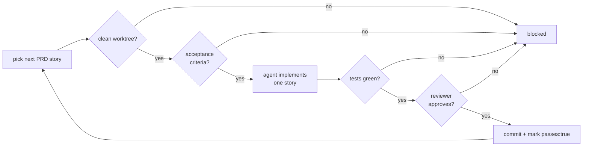

<div align="center">

# 🐂 Yoke

### One harness, every agent. Yoke it once — run it autonomously.

A cross-agent coding **harness** that installs a curated set of skills, safety policy, and tooling into **any project** for **Claude Code, OpenAI Codex CLI, and Gemini CLI** — plus an opt-in autonomous **loop** that ships a spec story-by-story behind hard, mechanical safety gates.

[](#-license)


</div>

---

## What is Yoke?

You curate **one source of truth** — skills, policy, and tool wiring. Yoke generates the **idiomatic, native artifacts** each agent expects (Claude skills + hooks, Codex `AGENTS.md` + config, Gemini commands + settings) — non-destructively, into any repo. Then, when you want it, the same harness can run an **autonomous loop** that picks the next story, implements it, runs your real tests, has an independent agent review it, and commits — never touching your working tree unless the work is green.

```text
   ┌─────────────┐      yoke retrofit       ┌──────────────────────────────┐
   │   CANON     │ ───────────────────────▶  │  Claude · Codex · Gemini     │
   │ (one truth) │   idiomatic per agent     │  skills · MCP · instructions │
   └─────────────┘                           └──────────────────────────────┘
                                                          │
                                              yoke loop run --isolate
                                                          ▼
                                       implement → test → review → commit
```

## ✨ Highlights

- 🤝 **Truly cross-agent** — Claude Code, Codex CLI, and Gemini CLI, generated from one canon. No copy-paste drift.
- 🧩 **Non-destructive retrofit** — every file is backed up before a change; re-runs are idempotent; `.claude/settings.json` is *merged*, never clobbered.
- 🤖 **Optional autonomous loop** — a Ralph-style loop that completes a PRD, gated by your real test suite and an independent agent review.
- 🛡️ **Mechanical safety gates** — clean-worktree, acceptance-criteria, green-tests, and role-separated review. Enforced in code, not by agent goodwill.
- 🧪 **Worktree isolation** — run each story in a throwaway git worktree; only verified, committed work is fast-forwarded back.
- 🧠 **Choose your code-graph** — graphify (fast, multimodal) or Serena (LSP-accurate) per project, with a recommendation at retrofit time.
- 🪙 **Token-aware** — wires rtk for command-output compression and ships a `minimal-code` skill that nudges every agent to write less.
- ✅ **140 tests, built test-first** — every component was TDD'd and passed a two-stage (spec + quality) review.

## 🚀 Quickstart

```bash
git clone <this-repo> && cd yoke
npm install

# 1) sanity-check the canon
npm run yoke -- validate canon

# 2) retrofit a project (asks/chooses code-graph; non-destructive)
npm run yoke -- retrofit /path/to/your/project --agent=all --code-graph=serena

# 3) (optional) run the autonomous loop on a PRD
npm run yoke -- loop on  /path/to/your/project
npm run yoke -- loop run /path/to/your/project --isolate --reviewer=claude --max=20
```

> Requires Node ≥ 20 and git. The MCP tools (rtk, graphify/Serena, Playwright MCP) are wired by Yoke but installed separately — the generated config is a clearly-labelled, adjustable template.

## 🏗️ Architecture


Three layers, three commands: **Canon** (`yoke validate`) → **Retrofit** (`yoke retrofit`) → **Loop** (`yoke loop`).

## 🔌 What gets generated per agent

| Agent | Artifacts |
|---|---|
| **Claude** | `.claude/skills/`, `AGENTS.md`, `CLAUDE.md`, `.mcp.json` (code-graph + Playwright), and an rtk `PreToolUse` hook when WSL is available |
| **Codex** | `AGENTS.md` (native), `.codex/config.toml` (MCP servers), `RTK.md` |
| **Gemini** | `GEMINI.md`, `.gemini/commands/*.toml` (one per skill), `.gemini/settings.json` (MCP + `AGENTS.md` context) |

> **rtk asymmetry, handled:** Claude can rewrite commands transparently via a hook (needs WSL on Windows); Codex and Gemini have no such hook, so they get an instruction to prefix commands with `rtk` instead.

## 🤖 The autonomous loop

Opt-in and off by default. Each iteration starts a **fresh agent** and passes through hard gates before anything is committed:



```bash
yoke loop on  .                 # enable (recorded in .yoke/config.yaml)
yoke loop status .              # show state + PRD progress
yoke loop run . \
  --runner=codex \               # implement with Codex…
  --reviewer=claude \            # …review with Claude (role separation)
  --isolate \                    # each story in a throwaway git worktree
  --max=20
yoke loop off .                 # disable
```

**PRD format** (`.yoke/prd.yaml`):

```yaml
- id: STORY-1
  title: Add a health endpoint
  priority: 1                    # lower = higher priority
  acceptance:                    # Definition of Done (required, else blocked)
    - GET /health returns 200
  passes: false                  # the loop sets this true only on green tests
```

The loop stops when every story is `passes: true`. State lives **outside the model context** — the PRD file plus git — so each iteration is fresh.

## 🛡️ Safety model

Yoke's guardrails are **mechanical, not advisory** — the loop blocks on a dirty worktree, missing acceptance criteria, red tests, or a reviewer rejection, and **none of them rely on the agent choosing to behave**.

- **Commit integrity** — a story is never recorded `passes: true` without a corresponding commit; a failed commit reverts the PRD.
- **Role separation** — the implementer never reviews its own work; `--reviewer` can even be a different agent.
- **Isolation** — with `--isolate`, failed or partial work is discarded with the worktree and never reaches your main tree.
- **Non-destructive retrofit** — existing files are backed up before any change; settings are merged, not replaced.
- **Independent verification** — "done" means *your test command exits 0*, not "the agent said so".

## 🧠 Choose your code-graph

`yoke retrofit --code-graph=graphify|serena` (default `graphify`, remembered per project). The `yoke-retrofit` skill asks and recommends based on the project.

| | **graphify** | **Serena** |
|---|---|---|
| Engine | tree-sitter AST + graph | real language servers (LSP) |
| Strength | fast, multimodal (code + PDFs + images) | symbol-exact cross-file refactoring |
| Token efficiency | ~70× reduction on large mixed repos | standard, no index to go stale |
| Best for | rapid exploration / migration / onboarding | systematic refactoring in typed codebases |
| Caveat | heuristic edges; static index can go stale | one language server per language |

## 🪙 Token efficiency

Yoke attacks tokens on two complementary surfaces:

- **rtk** compresses noisy command/tool output before it enters context (wired as a hook/instruction per agent).
- The **`minimal-code`** skill installs a YAGNI / "lazy senior dev" ladder so agents write the least code that solves the task — fewer output tokens, smaller review surface. *(Adapted from the MIT-licensed [ponytail](https://github.com/DietrichGebert/ponytail) ruleset.)*

## 🧩 How it's built

```text
canon/            # the source of truth — harness-agnostic
  AGENTS.md  skills/  policy/  loop/  tools/  manifest.yaml
src/
  canon/          # manifest schema + validator (yoke validate)
  retrofit/       # detect · plan · apply · planners (claude/codex/gemini) · tools
  loop/           # prd · gates · runner · verify · git/worktree · loop · run-command
docs/superpowers/ # the spec and every component's implementation plan
```

Yoke was built incrementally, **test-first**, one component at a time (Canon → retrofit → loop → verification → multi-agent → isolation → review). Every component went through a fresh implementer plus a **two-stage review** (spec compliance, then code quality) before merge — the design docs and plans live in [`docs/superpowers/`](docs/superpowers/).

## 🗺️ Roadmap

- **Multi-reviewer quorum** — N independent reviewers with distinct lenses (correctness / security / acceptance) instead of one.
- **Merge queue** — re-test against the latest main before integrating, for parallel/multi-agent loops.

## 🧪 Development

```bash
npm test          # vitest (140 tests)
npm run build     # tsc, no emit errors
npm run yoke -- validate canon
```

## 🙏 Credits & inspiration

Yoke stands on the shoulders of a great ecosystem: methodology ideas from [superpowers](https://github.com/obra/superpowers) and [gstack](https://github.com/garrytan/gstack); the [AGENTS.md](https://agents.md/) standard; the generator pattern from [wshobson/agents](https://github.com/wshobson/agents); the Ralph autonomous-loop pattern; safety-gate thinking from safe-agentic-workflow; and the wired tools [rtk](https://github.com/rtk-ai/rtk), [graphify](https://github.com/safishamsi/graphify), [Serena](https://github.com/oraios/serena), and [Playwright MCP](https://github.com/microsoft/playwright-mcp). The `minimal-code` skill adapts the MIT-licensed [ponytail](https://github.com/DietrichGebert/ponytail) ruleset.

## 📄 License

MIT — see [`LICENSE`](LICENSE).

<div align="center">
<sub>Built with a disciplined loop: brainstorm → spec → plan → TDD → two-stage review → merge.</sub>
</div>
