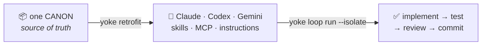
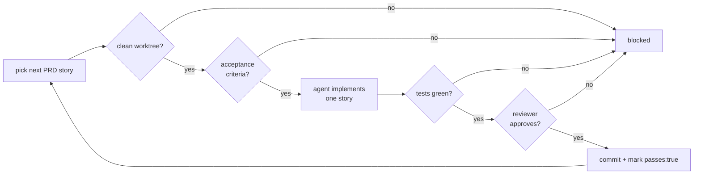

<div align="center">

# 🐂 Yoke

### One harness, every agent. Yoke it once — run it autonomously.

A cross-agent coding **harness** that installs a curated set of skills, safety policy, and tooling into **any project** for **Claude Code, OpenAI Codex CLI, and Gemini CLI** — plus an opt-in autonomous **loop** that ships a spec story-by-story behind hard, mechanical safety gates.

[](https://github.com/HECer/yoke/actions/workflows/ci.yml)
[](#-license)


</div>

---

## What is Yoke?

You curate **one source of truth** — skills, policy, and tool wiring. Yoke generates the **idiomatic, native artifacts** each agent expects (Claude skills + hooks, Codex `AGENTS.md` + config, Gemini commands + settings) — non-destructively, into any repo. Then, when you want it, the same harness can run an **autonomous loop** that picks the next story, implements it, runs your real tests, has an independent agent review it, and commits — never touching your working tree unless the work is green.



## ✨ Highlights

- 🤝 **Truly cross-agent** — Claude Code, Codex CLI, and Gemini CLI, generated from one canon. No copy-paste drift.
- 🧩 **Non-destructive retrofit** — every file is backed up before a change; re-runs are idempotent; `.claude/settings.json` is *merged*, never clobbered.
- 🤖 **Optional autonomous loop** — a Ralph-style loop that completes a PRD, gated by your real test suite and an independent agent review.
- 🛡️ **Mechanical safety gates** — clean-worktree, acceptance-criteria, green-tests, and role-separated review. Enforced in code, not by agent goodwill.
- 🧪 **Worktree isolation** — run each story in a throwaway git worktree; only verified, committed work is fast-forwarded back.
- 🧠 **Choose your code-graph** — graphify (fast, multimodal) or Serena (LSP-accurate) per project, with a recommendation at retrofit time.
- 🪙 **Token-aware** — wires rtk for command-output compression and ships a `minimal-code` skill that nudges every agent to write less.
- ✅ **203 tests, built test-first** — every component was TDD'd and passed a two-stage (spec + quality) review.

## 🚀 Quickstart

```bash
git clone https://github.com/HECer/yoke.git && cd yoke
npm install

# 1) sanity-check the canon
npm run yoke -- validate canon

# 2) retrofit a project (asks/chooses code-graph; non-destructive)
npm run yoke -- retrofit /path/to/your/project --agent=all --code-graph=serena

# 3) (optional) run the autonomous loop on a PRD
npm run yoke -- loop on  /path/to/your/project
npm run yoke -- loop run /path/to/your/project --isolate --reviewer=claude --max=20
```

> Requires Node ≥ 20 and git. The MCP tools (rtk, graphify/Serena, Playwright MCP) are wired by Yoke but installed separately — the generated config is a clearly-labelled, adjustable template.

## 🏗️ Architecture


Three layers: **Canon** (`yoke validate`) → **Retrofit** (`yoke retrofit`) → **Loop** (`yoke loop`), with a durable **Context layer** (`yoke context init|status`) underneath.

## 🔌 What gets generated per agent

| Agent | Artifacts |
|---|---|
| **Claude** | `.claude/skills/`, `AGENTS.md`, `CLAUDE.md`, `.mcp.json` (code-graph + Playwright), and an rtk `PreToolUse` hook when WSL is available |
| **Codex** | `AGENTS.md` (native), `.codex/config.toml` (MCP servers), `RTK.md` |
| **Gemini** | `GEMINI.md`, `.gemini/commands/*.toml` (one per skill), `.gemini/settings.json` (MCP + `AGENTS.md` context) |

> **rtk asymmetry, handled:** Claude can rewrite commands transparently via a hook (needs WSL on Windows); Codex and Gemini have no such hook, so they get an instruction to prefix commands with `rtk` instead.

## 🧰 What's in the canon — 25 skills

`yoke retrofit` installs all of these into each agent natively (Claude `.claude/skills/`, Codex/Gemini command + instruction artifacts). Provenance is credited in [`canon/skills/ATTRIBUTION.md`](canon/skills/ATTRIBUTION.md).

**Process / methodology** — *superpowers-derived discipline (13)*

| Skill | What it does |
|---|---|
| `brainstorming` | Explore intent, requirements & design before any creative work |
| `writing-plans` | Turn a spec into a bite-sized, TDD implementation plan |
| `executing-plans` | Execute a written plan in a separate session with review checkpoints |
| `subagent-driven-development` | Run a plan task-by-task: fresh subagent + two-stage review each |
| `tdd` | Write the test first, watch it fail, write minimal code, refactor |
| `systematic-debugging` | Root-cause first — no fix without a confirmed cause |
| `verification-before-completion` | Prove it actually works before claiming done |
| `using-git-worktrees` | Isolated worktrees for safe / parallel work |
| `requesting-code-review` | Request a structured review before merging |
| `receiving-code-review` | Handle review feedback with rigor, not blind agreement |
| `dispatching-parallel-agents` | Fan out 2+ independent tasks concurrently |
| `finishing-a-development-branch` | Merge / PR / cleanup a finished branch |
| `writing-skills` | Author and verify new skills |

**Roles** — *gstack-derived, de-gstacked to be harness-agnostic (8)*

| Skill | What it does |
|---|---|
| `eng-review` | Engineering-manager review of a change before merge |
| `plan-eng-review` | Architecture / edge-case review of a *plan* |
| `plan-ceo-review` | Founder-mode scope & ambition review of a plan |
| `review` | Pre-landing diff review (SQL safety, trust boundaries, side effects) |
| `ship` | Ship workflow: tests → review → version → changelog → PR |
| `health` | Code-quality dashboard with a composite score |
| `retro` | Engineering retrospective from commit history |
| `document-release` | Post-ship documentation sync (README / CHANGELOG / …) |

**Yoke-native** — *authored or adapted for this harness (4)*

| Skill | What it does |
|---|---|
| `yoke-retrofit` | Set up the Yoke harness in a project (detect → plan → apply) |
| `minimal-code` | Write the least code that solves the task (YAGNI; ponytail-derived) |
| `maintaining-context` | Keep `.yoke/context/` the durable source of truth (the Context layer) |
| `workflow` | The default order of operations, from idea to deploy |

## 🤖 The autonomous loop

Opt-in and off by default. Each iteration starts a **fresh agent** and passes through hard gates before anything is committed:



```bash
yoke loop on  .                 # enable (recorded in .yoke/config.yaml)
yoke loop status .              # show state + PRD progress
yoke loop run . \
  --runner=codex \               # implement with Codex…
  --reviewer=claude \            # …review with Claude (role separation)
  --isolate \                    # each story in a throwaway git worktree
  --max=20
yoke loop off .                 # disable
```

**PRD format** (`.yoke/prd.yaml`):

```yaml
- id: STORY-1
  title: Add a health endpoint
  priority: 1                    # lower = higher priority
  acceptance:                    # Definition of Done (required, else blocked)
    - GET /health returns 200
  passes: false                  # the loop sets this true only on green tests
```

The loop stops when every story is `passes: true`. State lives **outside the model context** — the PRD file plus git — so each iteration is fresh.

### Watching a run

Every iteration emits token-free, harness-side feedback (Node console + local files — **zero agent tokens**):

- **Live console** — `▶ S6 (19/45) — implementing… · verifying… ✔ committed → 20/45`.
- **`.yoke/loop-status.json`** — the current state; read it any time with `yoke loop status`:
  ```
  Loop: BLOCKED on S5 "Segment schemas"
    verifying · iteration 19 · 18/45 · updated 2026-06-29T10:00:00.000Z
    reason: story did not verify (working tree has uncommitted changes — review/clean before re-running)
  ```
- **`.yoke/loop.log`** — an append-only timeline of every phase transition.

A per-iteration **idle timeout** guards against a genuinely hung agent: if the agent produces
**no output at all** for `--timeout` minutes (default 20; `0` disables), the loop kills it
(SIGTERM→SIGKILL) and marks the story blocked. A slow-but-working agent that keeps streaming
output is **never** killed — the output stream *is* the liveness signal. Set a project default
with `loop.timeoutMinutes` in `.yoke/config.yaml`.

`.yoke/loop-status.json` and `.yoke/loop.log` are runtime artifacts; `yoke retrofit` gitignores
them (along with `.yoke/worktrees/` and `.yoke/backup/`) so they never trip the clean-tree gate.

## Context layer (`.yoke/context/`)

Yoke keeps durable, cross-session context so a fresh-context agent is never blind:

- `PROJECT.md` — the north star (goal, constraints, non-goals, success criteria).
- `DECISIONS.md` — an append-only ledger. The loop adds an entry per completed story; you and agents add the *why*.
- `KNOWLEDGE.md` — reusable gotchas and conventions.

`yoke retrofit` scaffolds these files (non-destructively — your edits are never overwritten).
The loop reads them into every agent + reviewer prompt and logs decisions back on each story's
commit. Manage them directly with `yoke context init` and `yoke context status`. The
`maintaining-context` skill teaches agents to honour the same files during interactive work.

> Commit `.yoke/context/` to git. The `--isolate` loop runs each iteration in a worktree
> checked out from HEAD, so it only sees committed context.

## 🛡️ Safety model

Yoke's guardrails are **mechanical, not advisory** — the loop blocks on a dirty worktree, missing acceptance criteria, red tests, or a reviewer rejection, and **none of them rely on the agent choosing to behave**.

- **Commit integrity** — a story is never recorded `passes: true` without a corresponding commit; a failed commit reverts the PRD.
- **Role separation** — the implementer never reviews its own work; `--reviewer` can even be a different agent.
- **Isolation** — with `--isolate`, failed or partial work is discarded with the worktree and never reaches your main tree.
- **Non-destructive retrofit** — existing files are backed up before any change; settings are merged, not replaced.
- **Independent verification** — "done" means *your test command exits 0*, not "the agent said so".

## 🧠 Choose your code-graph

`yoke retrofit --code-graph=graphify|serena` (default `graphify`, remembered per project). The `yoke-retrofit` skill asks and recommends based on the project.

| | **graphify** | **Serena** |
|---|---|---|
| Engine | tree-sitter AST + graph | real language servers (LSP) |
| Strength | fast, multimodal (code + PDFs + images) | symbol-exact cross-file refactoring |
| Token efficiency | ~70× reduction on large mixed repos | standard, no index to go stale |
| Best for | rapid exploration / migration / onboarding | systematic refactoring in typed codebases |
| Caveat | heuristic edges; static index can go stale | one language server per language |

## 🪙 Token efficiency

Yoke attacks tokens on two complementary surfaces:

- **rtk** compresses noisy command/tool output before it enters context (wired as a hook/instruction per agent).
- The **`minimal-code`** skill installs a YAGNI / "lazy senior dev" ladder so agents write the least code that solves the task — fewer output tokens, smaller review surface. *(Adapted from the MIT-licensed [ponytail](https://github.com/DietrichGebert/ponytail) ruleset.)*

## 🌱 Why & how it was built

**The problem.** Coding agents are powerful, but each speaks its own dialect — Claude has skills and hooks, Codex reads `AGENTS.md` and a TOML config, Gemini wants commands and a settings file. Keeping the same skills, safety policy, and tool wiring consistent across all of them means copy-paste drift and three things to maintain. Yoke exists to keep **one** source of truth, generate the right native artifacts for each agent, and let that harness run **autonomously and safely** when you want to hand it a spec and walk away.

**The inspiration.** Yoke is a synthesis of ideas already proven across the ecosystem: composable-skills methodology ([superpowers](https://github.com/obra/superpowers), [gstack](https://github.com/garrytan/gstack)); the portable [AGENTS.md](https://agents.md/) standard; the *"one source-of-truth → idiomatic per-harness artifacts"* generation pattern ([wshobson/agents](https://github.com/wshobson/agents)); spec-driven autonomous orchestration (GSD); mechanical safety gates and role separation (safe-agentic-workflow); and the **Ralph loop** (Geoff Huntley) — keep handing a *fresh* agent the next task until the spec is done. Token efficiency comes from [rtk](https://github.com/rtk-ai/rtk) and the write-less-code idea behind [ponytail](https://github.com/DietrichGebert/ponytail).

**How it was built.** Yoke was built the way it's meant to be *used* — agent-driven, incremental, and test-first. The stack was chosen by **researching alternatives first** (which is how `jcodemunch` was dropped for its license and Serena was added as an option). Then every component shipped one small piece at a time through a disciplined loop: **brainstorm → spec → plan → TDD implementation → an independent two-stage review** (does it match the spec? is it well-built?) **→ merge**. Those reviews caught real bugs before they shipped — a Windows `.cmd` spawn failure, a commit-integrity hole, a missing infinite-loop guard, a TOML-escaping bug, a hook-duplication bug. Yoke was even **dogfooded on its own repo**, which surfaced (and fixed) a genuine Windows bug. Every spec and plan lives in [`docs/superpowers/`](docs/superpowers/).

## 🗂️ Project layout

```text
canon/            # the source of truth — harness-agnostic
  AGENTS.md  skills/  policy/  loop/  tools/  manifest.yaml
src/
  canon/          # manifest schema + validator (yoke validate)
  retrofit/       # detect · plan · apply · planners (claude/codex/gemini) · tools
  loop/           # prd · gates · runner · verify · git/worktree · loop · run-command
docs/superpowers/ # the spec and every component's implementation plan
```

## 🗺️ Roadmap

- **Multi-reviewer quorum** — N independent reviewers with distinct lenses (correctness / security / acceptance) instead of one.
- **Merge queue** — re-test against the latest main before integrating, for parallel/multi-agent loops.

## 🧪 Development

```bash
npm test          # vitest (203 tests)
npm run build     # tsc, no emit errors
npm run yoke -- validate canon
```

## 🙏 Credits & inspiration

Yoke stands on the shoulders of a great ecosystem: methodology ideas from [superpowers](https://github.com/obra/superpowers) and [gstack](https://github.com/garrytan/gstack); the [AGENTS.md](https://agents.md/) standard; the generator pattern from [wshobson/agents](https://github.com/wshobson/agents); the Ralph autonomous-loop pattern; safety-gate thinking from safe-agentic-workflow; and the wired tools [rtk](https://github.com/rtk-ai/rtk), [graphify](https://github.com/safishamsi/graphify), [Serena](https://github.com/oraios/serena), and [Playwright MCP](https://github.com/microsoft/playwright-mcp). The `minimal-code` skill adapts the MIT-licensed [ponytail](https://github.com/DietrichGebert/ponytail) ruleset.

## 📄 License

MIT — see [`LICENSE`](LICENSE).

<div align="center">
<sub>Built with a disciplined loop: brainstorm → spec → plan → TDD → two-stage review → merge.</sub>
</div>
