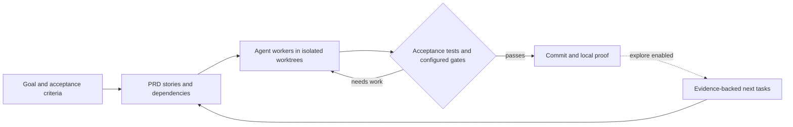

<div align="center">


# Yoke

### Autonomous coding across your agents. Proof before done.

[](https://www.npmjs.com/package/@hecer/yoke)
[](https://github.com/HECer/yoke/actions/workflows/ci.yml)
[](LICENSE)


<!-- yoke:version:start -->1.21.1<!-- yoke:version:end --> · <!-- yoke:tests:start -->1426<!-- yoke:tests:end --> test cases · <!-- yoke:skills:start -->34<!-- yoke:skills:end --> skills

<!-- yoke:agents:start -->Claude | Codex | Gemini | Qwen | OpenCode | Kilo | Pi | Hermes<!-- yoke:agents:end -->

</div>

Yoke turns a goal into acceptance-tested stories, coordinates one or more coding agents, and commits work only after the configured checks pass. Run a normal backlog to completion, or optionally let Yoke explore for evidence-backed improvements and continue the same verified loop.

## How it works


```mermaid
flowchart LR
  A[Goal and acceptance criteria] --> B[PRD stories and dependencies]
  B --> C[Agent workers in isolated worktrees]
  C --> D{Acceptance tests and configured gates}
  D -- needs work --> C
  D -- passes --> E[Commit and local proof]
  E -. explore enabled .-> F[Evidence-backed next tasks]
  F --> B
```

Each story carries observable acceptance criteria and targeted test commands. Parallel workers take independent stories; Yoke checks their integrated result before committing. Proof is saved under `.yoke/proof/`.

## What Yoke adds

| Capability | What it does for you |
| --- | --- |
| **Verified completion** | Checks acceptance criteria, the project verify command, and any configured completion, review, quality, or browser gates before accepting work. |
| **Parallel execution** | Schedules independent stories in isolated worktrees, respects dependencies and write scopes, and coordinates a shared worker limit across projects. |
| **Durable goals** | Binds objectives to executable acceptance, shares worker capacity, records budgets, and optionally resumes native Codex goal threads. |
| **Long-running autonomy** | Recovers from provider failures and blocked work. Optional exploration discovers new, repository-evidenced tasks after the planned backlog drains. |
| **A choice of agents** | Uses the native CLI for Claude, Codex, Gemini, Qwen, OpenCode, Kilo, Pi, or Hermes. Install and authenticate the CLI you choose; Yoke does not bundle model runtimes or credentials. |
| **Project visibility** | A local dashboard shows project status, **Workspace analytics**, **History**, and controls such as **Queue a change**, safe-boundary pause/resume, and operator notes. It runs with the local Yoke process. Dark and light themes are available. |
| **Optional Pi efficiency** | An opt-in SoL-Pi integration exposes per-project mechanism settings for Pi. It is off by default; benchmark results are not a savings guarantee. |

## Quick start

Requires Node.js 20+ and Git. Install Yoke and create a project with a draft backlog:

```sh
npm install --global @hecer/yoke
yoke new my-app --idea="A reading list app" --agent=codex --runner=codex
```

Set `verify.command` in `my-app/.yoke/config.yaml` to the project's real test command, then run:

```sh
yoke loop on my-app
yoke loop run my-app --isolate --parallel=auto
```

For an existing project, run `yoke setup .`, set `verify.command`, and draft a backlog with `yoke prd draft . --idea="..."`. Add `--review` when an independent reviewer is configured.

**PRD format** (`.yoke/prd.yaml`):

```yaml
- id: STORY-1
  title: Add a health endpoint
  priority: 1
  acceptance:
    - id: health-returns-200
      text: GET /health returns 200
      verify: [npm run test:health-returns-200]
    - id: health-rejects-post
      text: POST /health returns 405
      verify: [npm run test:health-rejects-post]
  passes: false
```

Yoke requires 2–5 behavioral criteria on new stories by default. Each criterion needs an approved test command containing its ID. See the [PRD schema](canon/loop/prd.schema.md).

## Optional continuous exploration

Exploration is **off by default**. Add `--explore` to keep the supervisor active after the current backlog drains. It proposes bounded work from repository evidence; accepted tasks still pass through the project's normal tests and configured gates.

```sh
yoke loop run my-app --explore --parallel=auto --explore-limit=3d
yoke loop status my-app
yoke loop pause my-app
```

Without `--explore-limit`, exploration has no time limit. A limit such as `12h`, `3d`, or `2w` requests a pause at the next safe boundary; active stories finish their normal gates and integration first, so the process can run past the deadline while that work completes. The supervisor requires an available machine, running process, and usable providers. Read the [continuous exploration guide](docs/CONTINUOUS-EXPLORATION.md) for discovery rules, retries, stop detection, and recovery.

## Parallel workers

Use `--parallel=auto` or `--parallel=N` to run independent stories together. The scheduler observes story dependencies, collision areas, and declared write scopes. A shared user-level pool admits up to three worker units by default; `YOKE_MAX_PARALLEL_WORKERS` adjusts that ceiling from 1 to 8. See [parallel execution](docs/parallel-execution.md) for admission, integration, and recovery details.

## Dashboard

Register projects and start the loopback-only dashboard:

```sh
yoke projects add /path/to/project
yoke dashboard
```

The dashboard is a local control room. It does not discover every process or run arbitrary shell commands. See the [dashboard guide](docs/DASHBOARD-EVOLUTION.md) for data coverage and measurement limits.

## Agent and feature guides

| Guide | Details |
| --- | --- |
| [Harnesses](docs/HARNESSES.md) | CLI setup, permissions, provider/model selection, and telemetry limits |
| [SoL-Pi for Pi](docs/SOL-PI.md) | Opt-in settings, supported runtime, project trust, data handling, and paper evidence |
| [Parallel execution](docs/parallel-execution.md) | Worker scheduling, shared capacity, integration, and recovery |
| [Continuous exploration](docs/CONTINUOUS-EXPLORATION.md) | Autonomous discovery, runtime limits, pause/resume, and stop detection |
| [Project workflows](docs/VERIFIED-PROJECTS.md) | Setup, verification, goals, and execution defaults |
| [Verified goals](docs/GOALS.md) | Acceptance binding, native Codex goals, budgets, and resource admission |
| [Code Intelligence](docs/CODE-INTELLIGENCE.md) | Optional Graphify, Serena, and Graft evidence providers |
| [Dashboard](docs/DASHBOARD-EVOLUTION.md) | Project views, history, controls, and reporting boundaries |
| [Benchmarks](bench/RESULTS.md) | Direct Codex comparison, routing studies, sample limits, and integration findings |
| [Changelog](CHANGELOG.md) | Release features, behavior changes, and migration notes |

## Safety and limits

- A green result means the configured checks passed; the project remains responsible for meaningful tests and acceptance criteria.
- Harness permissions differ. Some CLIs do not provide an OS-level sandbox; use Yoke's read-only profile for inspection and review.
- Exploration filters proposals but cannot guarantee product maturity or model quality. Time limits pause at safe boundaries; they do not kill an active story mid-integration.
- SoL-Pi is an optional Pi extension. Its pinned upstream lists Node.js 22.19+ and `@earendil-works/pi-coding-agent@0.84.2` as the tested baseline; Yoke does not enforce the Pi version. Pi project trust may be required. See [SoL-Pi limits](docs/SOL-PI.md).

## Development

```sh
git clone https://github.com/HECer/yoke.git
cd yoke
npm ci
npm run lint
npm run build
npm test
npm run docs:check
```

Yoke is released under the [MIT License](LICENSE).
